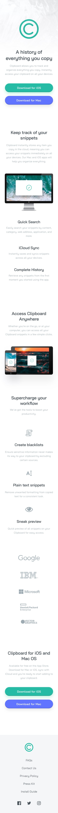
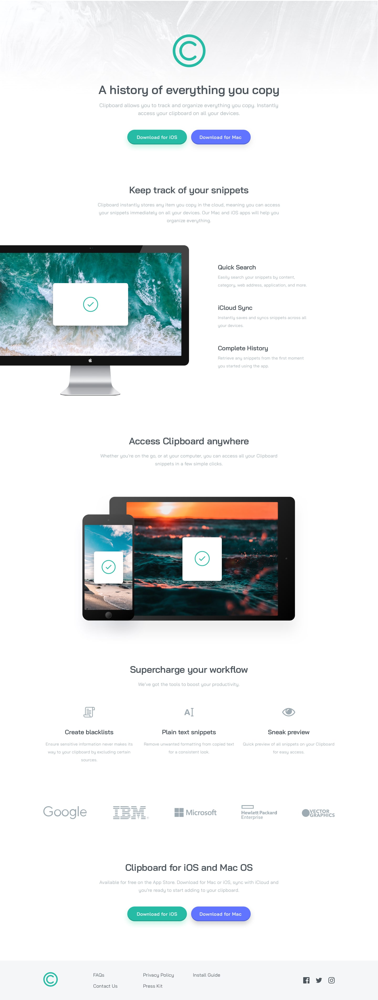
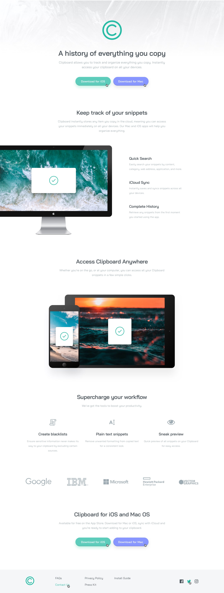

## Website Built From Three Images

I converted images of UI designs into webpages more often when I first started CSS and could only find a limited number of complete design files online that I could work with. 

As an exercise in a course I enrolled in, I got the chance to do it again. 

### Interesting features:
- chaining related CSS declarations together greatly helped with organisation
- using different viewport limits i.e. @media (min-width: 700px) for each section ensures that they all display well across different screen sizes

Credit to [www.frontendmentor.io](https://www.frontendmentor.io/challenges/clipboard-landing-page-5cc9bccd6c4c91111378ecb9) for the design.

